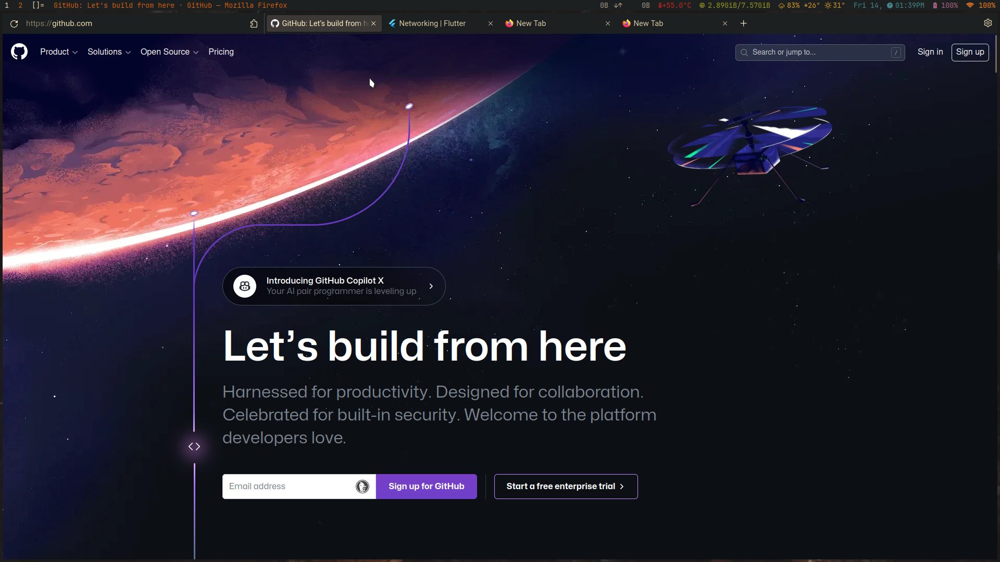

# Theme Firefox



## Installation

- Pada search bar cari `about:config` -> kemudian pilih `accept and risk continue`
- Masukkan pencarian `toolkit.legacyUserProfileCustomizations.stylesheets` dan atur agar menjadi **enable**
- Next seakrang ganti **config** jadi **profile** pada search bar  `about:profiles` dan buka directory root
- Buat seuah directory baru dengan nama `chrome` dan buat file **css** di dalam directory **chrome** dengan nama `userChrome.css`
- Salin semua isi dari **userChrome css** ini kedalam file `userChrome.css` yang telah dibuat
- Agar **Toolbar** firefox tidak terlalu tinggi, klik kanan pada toolbar -> costomize Toolbar -> Pada bagian pojok kiri bawah pilih **Density** -> menjadi **compact**
- Silahkan drag menu sesuai kebutuhan
- Jika ada masalah pada background toolbar sialahkan install theme kesukaan anda saya menggunakan `gruvbox dark-hard` atau ganti background pada
  
  ```css
  #navigator-toolbox-background {
      --lwt-accent-color: #1D2021;
   }
  ```

## Live Debuging

Ini bertujuan untuk memudahkan menemukan element pada **firefox**

`ctrl + shift + i` -> menu lanjutan titik tiga -> pilih settings

silahkan centang:

- enable rowser chrome and add-on debugging toolboxes
- enable remote debuggin

`ctrl + shift + alt + i` -> allow remote debuggin select **OK** untuk mulai inspest elemt pada firefox

- pilih menu **style editor** filter masukkan pencarian **userChrome** untuk mengedit css dan mendapatkan perubahan seacara langsung, silahkan gunakan menu pick element untuk mendapatkan **id** atau **class** pada setiap element yang akan di hilangkan atau di modifikasi. selain itu pada inspect element ini juga memudahkan kita dalam memodifikasi setiap element dan jika dirasa sudah bagus kode css element jangan lupa di salin dan di tempelkan pada css costum anda `userChrome.css`  
